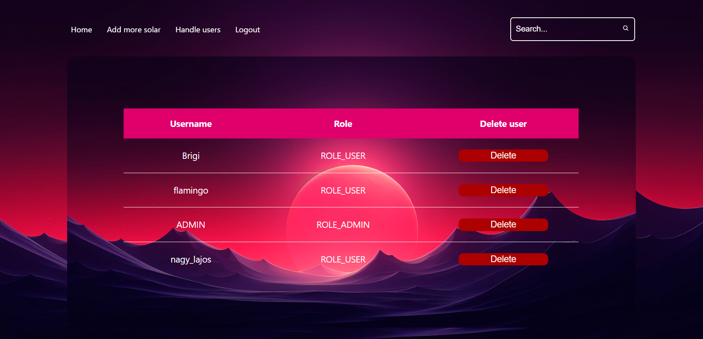
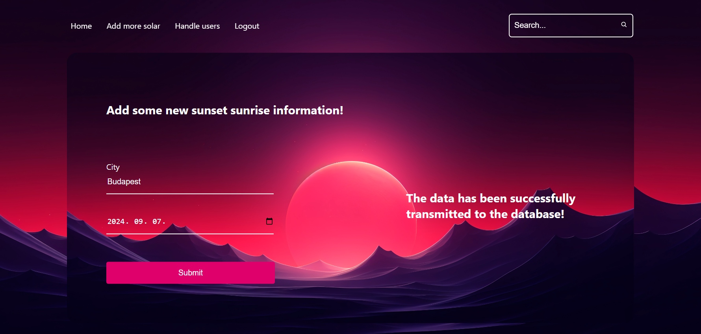

# SolarWatch

## Overview

**SolarWatch** is a full-stack web application developed using Java Spring Boot. It allows users to register or login, select a city from a predefined list, and choose a past date. The application then provides the sunrise and sunset times for that specific date and location. This tool is perfect for those who need historical solar data for various purposes.

## Getting Started

### Prerequisites

#### To Run the Project with Docker:
   - [![docker][docker]][docker-url]

#### To Run Backend and Frontend Separately:
  - [![java][java]][java-url]
  - [![maven][maven]][maven-url]
  - [![postgresql][postgresql]][postgresql-url]
  - [![nodejs][node.js]][node-url]
  - [![npm][npm]][npm-url]

### Installation

#### Running the Project with Docker
1. Clone the repository:
   ```bash
   git clone https://github.com/CodecoolGlobal/solarwatch-new-features-general-zsbrigi
   cd <foldername>
   ```

2. Set environment variables in `.env-sample`:
   ```bash
   # db env variables
   POSTGRES_DB=YOUR_DB_NAME
   POSTGRES_USER=YOUR_DB_USERNAME
   POSTGRES_PASSWORD=YOUR_DB_PASSWORD

   ## backend env variables
   SPRING_DATASOURCE_USERNAME=YOUR_DB_USERNAME
   SPRING_DATASOURCE_PASSWORD=YOUR_DB_PASSWORD
   CODECOOL_APP_JWTSECRET=YOUR_JWT_SECRET_KEY
   ```
   *The JWT secret key should be 64 characters long and should only include alphanumeric characters (A-Z, a-z, 0-9). It is advisable to avoid using special characters such as `-`, `/`, `+`, and `=` to prevent potential issues with encryption and encoding.*
3. Rename `.env-sample` to `.env`:
   ```
   mv .env-sample .env
   ```

4. Build and start the containers:
   ```bash
   docker compose up --build
   ```

   *Docker will automatically set up the database and run the backend and frontend services.*

#### Running Backend and Frontend Separately

##### Backend Setup:
1. Navigate to the backend directory:
   ```bash
   cd backend_solarwatch
   ```

2. Build the project:
   ```bash
   mvn clean install
   ```

3. Set environment variables:
   - If running locally, you must create the PostgreSQL database on your machine and set the connection details.
   - Update application.properties (src/main/resources/application.properties) with your database credentials and security data or you can use terminal commands:
   - Option 1: Using PowerShell
     ```bash
     $env:DATABASE_URL="jdbc:postgresql://localhost:5432/solarWatch"
     $env:DATABASE_USERNAME="YOUR_DATABASE_USERNAME"
     $env:DATABASE_PASSWORD="YOUR_DATABASE_PASSWORD"
     $env:JWTSECRETKEY="YOUR_JWT_SECRET_KEY"
     ```
     *The JWT secret key should be 64 characters long and should only include alphanumeric characters (A-Z, a-z, 0-9). It is advisable to avoid using special characters such as `-`, `/`, `+`, and `=` to prevent potential issues with encryption and encoding.*

   - Option 2: Using Command Prompt
     ```bash
     set DATABASE_URL=jdbc:postgresql://localhost:5432/solarWatch
     set DATABASE_USERNAME=YOUR_DATABASE_USERNAME
     set DATABASE_PASSWORD=YOUR_DATABASE_PASSWORD
     set JWTSECRETKEY=YOUR_JWT_SECRET_KEY
     ```

4. Run the application:
   ```bash
   mvn spring-boot:run
   ```

##### Frontend Setup:
1. Navigate to the frontend directory:
   ```bash
   cd ../frontend
   ```

2. Install dependencies:
   ```bash
   npm install
   ```

3. Start the development server:
   ```bash
   npm run dev
   ```

## Features

### Dockerization
- The application is fully containerized using Docker.
- Docker Compose manages the PostgreSQL database, backend, and frontend services.
- Running with Docker Compose eliminates the need to manually create the database or configure environment variables locally.

### User Management
- User Registration and Authentication using Spring Security and JWT tokens.
- Includes role-based access control with user and admin roles.

### Admin Page
- User Management: Administrators can view and delete user accounts directly from the admin panel.
- Solar Data Management: Administrators can manually add new solar data (e.g., sunrise and sunset times) for specific cities and dates.

### Frontend Integration
- Built with React-Vite, featuring RESTful API integration and client-side routing using React Router.

### Integration Testing
- Integration tests cover API calls and database interactions to ensure system reliability.

## Usage

1. **User Registration and Login**:
   - Users can register and log in.
     

2. **Retrieve Sunrise and Sunset Data**:
   - Select a city and date to get solar data.
     

3. Administrator pages:
   - Administrators can manage users and solar data:
      - Delete users from the database.
      
      - Add new solar-watch data.
      
   

## Git History

This project was developed over multiple sprints, with different features being worked on in separate repositories. This may result in an unconventional Git history structure. The separate sprint-based repositories were later consolidated into a single repository.
1. **First Sprint**: Created the project, implemented API-based data retrieval, and wrote unit tests.
2. **Second Sprint**: Integrated Spring Data JPA for database communication.
3. **Third Sprint**: Added Spring Security for user login and registration, along with a React frontend.
4. **Final Sprint**: Dockerized the project and added integration tests.


## Technologie Stack
### Backend:
- [![spring-boot][spring-boot]][spring-boot-url]
- [![spring-web-mvc][spring-web-mvc]][spring-web-mvc-url]
- [![spring-data-jpa][spring-data-jpa]][spring-data-jpa-url]
- [![spring-security][spring-security]][spring-security-url]
- [![hibernate][hibernate]][hibernate-url]

### Database:
- [![postgresql][postgresql]][postgresql-url]

### Frontend:
- [![React-Vite][React-Vite]][Vite-URL]
- [![Css][Css3]][Css-url]

### Containerization:
- [![docker][docker]][docker-url]

[React-Vite]: https://img.shields.io/badge/-Vite-D3D3D3?logo=Vite&logoColor=646CFF
[Vite-URL]: https://vitejs.dev/guide/

[Css3]: https://img.shields.io/badge/Css-4361ee?style=for-the-badge&logo=css&logoColor=61DAFB
[Css-url]: https://en.wikipedia.org/wiki/CSS

[docker]: https://img.shields.io/badge/Docker-2496ED?style=for-the-badge&logo=docker&logoColor=white
[docker-url]: https://docs.docker.com/engine/install/

[spring-boot]: https://img.shields.io/badge/SpringBoot-6DB33F?style=for-the-badge&logo=Spring&logoColor=white
[spring-boot-url]: https://docs.spring.io/spring-boot/installing.html

[spring-web-mvc]: https://img.shields.io/badge/SPRING%20WEB%20MVC-6DB33F?style=for-the-badge&logo=Spring&logoColor=white
[spring-web-mvc-url]: https://docs.spring.io/spring-framework/reference/web/webmvc.html

[spring-data-jpa]: https://img.shields.io/badge/SPRING%20DATA%20JPA-6DB33F?style=for-the-badge&logo=Spring&logoColor=white
[spring-data-jpa-url]: https://spring.io/projects/spring-data-jpa

[spring-security]: https://img.shields.io/badge/Spring%20Security-6DB33F?style=for-the-badge&logo=springsecurity&logoColor=white
[spring-security-url]: https://spring.io/projects/spring-security

[hibernate]: https://img.shields.io/badge/Hibernate-59666C?style=for-the-badge&logo=hibernate&logoColor=white
[hibernate-url]: https://hibernate.org/ 

[postgresql]: https://img.shields.io/badge/postgresql-4169e1?style=for-the-badge&logo=postgresql&logoColor=white
[postgresql-url]: https://www.postgresql.org/download/

[java]: https://img.shields.io/badge/Java-17%2B-ED8B00?style=for-the-badge&labelColor=ED8B00&logo=java&color=808080[Java
[java-url]: https://www.java.com/en/download/

[maven]: https://img.shields.io/badge/Maven-4%2B-ED8B00?style=for-the-badge&labelColor=ED8B00&logo=maven&color=808080[Maven
[maven-url]: https://maven.apache.org/

[node.js]: https://img.shields.io/badge/Node.js-339933?style=for-the-badge&logo=nodedotjs&logoColor=white
[node-url]: https://nodejs.org/en

[npm]: https://img.shields.io/badge/npm-CB3837?style=for-the-badge&logo=npm&logoColor=white
[npm-url]: https://www.npmjs.com/